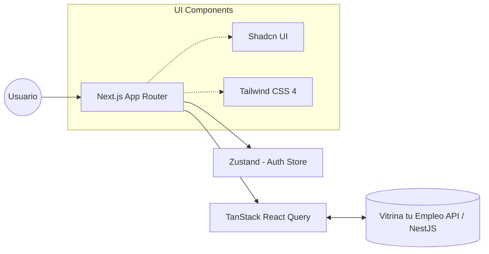

<div align="center">
  <h1>✨ Vitrina tu Empleo - Frontend</h1>
  <p><em>La interfaz de usuario rápida, accesible y moderna para nuestra plataforma de conexión de talento.</em></p>
</div>

<br />

Este repositorio contiene la aplicación cliente construida para **Vitrina tu Empleo**, asegurando una experiencia fluida tanto para candidatos buscando oportunidades en modo anónimo, como para empresas buscando el talento ideal.

## 🚀 Características y Arquitectura

La arquitectura frontend está orientada a la mantenibilidad y un rendimiento óptimo de carga.



### Funcionalidades Destacadas

- 🔐 **Autenticación (Zustand & JWT):** Integración segura con intercepción de peticiones e hidratación de estados en cliente.
- 🧑‍💼 **Gestión Integral de Perfiles:** Formularios dinámicos anidados (Idiomas, Educación, Certificaciones) utilizando `react-hook-form` y `zod`.
- 📅 **Control de Disponibilidad:** Ajustes granulares de expectativa salarial, modalidad (híbrido/remoto) y estado actual de búsqueda.
- 🕶️ **Control de Privacidad Absoluta:** Opciones de visibilidad explícitas (`PUBLIC`, `ANONYMIZED`, `PRIVATE`) directamente en el dashboard.

## 🛠️ Stack Tecnológico

| Herramienta | Propósito |
|---|---|
| **Next.js 16+** | Framework React (App Router, Server Components). |
| **Tailwind CSS 4** | Estilizado ágil y utility-first. |
| **Shadcn UI / Radix** | Componentes base accesibles y sin estilos restrictivos. |
| **Zustand** | Manejo de estado de cliente global (e.g. sesión, tokens). |
| **TanStack Query** | Manejo de estado asíncrono, caché, e invalidación contra la API. |
| **React Hook Form + Zod** | Validación y manejo de estados complejos en formularios. |

---

## 🐳 Despliegue con Docker (Producción)

Dado que es común correr un backend (e.g., NestJS) en el puerto `3000`, este frontend ha sido dockerizado utilizando estrategias avanzadas (**Multi-stage builds** y **Next.js Standalone Output**) para ser sumamente ligero y correr de forma independiente en el puerto `3001`.

### 1. Construir y correr con Docker Compose (Recomendado)
Puedes levantar el contenedor optimizado con un solo comando:
```bash
docker-compose up -d --build
```
La aplicación estará disponible en **[http://localhost:3001](http://localhost:3001)**.

### 2. Comandos Manuales de Docker
Si prefieres no usar `docker-compose`:
```bash
# Construir la imagen
docker build -t portal-desempleo-frontend:latest .

# Correr el contenedor en el puerto 3001
docker run -p 3001:3001 -d portal-desempleo-frontend:latest
```

---

## ⚙️ Inicialización Rápida (Desarrollo Local)

### 1. Clonar el repositorio

Asegúrate de clonar el proyecto y abrir el directorio del frontend:

```bash
git clone <url-del-repositorio>
cd portal-desempleo/frontend
```

### 2. Instalar dependencias

Puedes usar `npm`, `yarn`, `pnpm` o `bun`:

```bash
npm install
```

### 3. Configurar las variables de entorno

Crea un archivo `.env.local` en la raíz del frontend:

```env
NEXT_PUBLIC_API_URL="http://localhost:3002/api/v1"
```

### 4. Iniciar el entorno de desarrollo

```bash
npm run dev
```

🚀 Abre **[http://localhost:3001](http://localhost:3001)** (o 3000 si está libre) en tu navegador y explora la plataforma.

---

## 📂 Estructura de Directorios Clave

```text
frontend/src/
├── app/                  # Sistema de enrutamiento App Router (rutas, layouts, pages)
│   ├── (auth)/login/     # Flujo de autenticación
│   ├── dashboard/        # Landing interno protegido
│   └── profile/          # Gestión completa de candidato (perfil, disponibilidad)
├── components/ui/        # Componentes atómicos inyectados vía Shadcn CLI
├── lib/                  # Utilidades como `api.ts` (Fetch customizado con inyección JWT)
└── store/                # Estados de Zustand (ej. `useAuthStore.ts`)
```

---

## 🏗️ Infraestructura y Guía de Trabajo (Workflow)

Para mantener una base de código profesional, escalable y libre de errores, seguimos las siguientes prácticas y metodologías de trabajo:

### 1. Flujo de Ramas (Trunk-based Development / GitFlow)
- **`main`**: Rama principal que siempre debe estar en un estado estable y desplegable en producción.
- **`develop`**: (Opcional) Rama de integración principal para ambientes de pruebas y QA.
- **Ramas de Características (`feature/*`)**: Para desarrollar nuevas funcionalidades (ej. `feature/login-ui`).
- **Ramas de Correcciones (`bugfix/*` o `hotfix/*`)**: Para arreglar problemas específicos (ej. `bugfix/profile-crash`).

Nunca se debe hacer *push* directo a `main`. Todo código nuevo debe integrarse mediante un **Pull Request (PR)**.

### 2. Convención de Commits (Conventional Commits)
Recomendamos el uso de mensajes de commit semánticos y estructurados para facilitar la lectura del historial y automatización de versiones:
- `feat: agregar formulario de login` (Nueva funcionalidad)
- `fix: corregir error de tipo en api.ts` (Corrección de error)
- `refactor: optimizar renderizado en perfil` (Cambio de código sin modificar funcionalidad)
- `chore: actualizar dependencias` (Mantenimiento, configuración)

### 3. Integración Continua (CI/CD)
El proyecto cuenta con integración continua utilizando **GitHub Actions**. Al momento de abrir o actualizar un PR hacia `main` o `develop`, se ejecutan automáticamente las siguientes tareas:
- **Linting**: Se verifica que el código cumpla con las reglas de ESLint sin arrojar errores.
- **Build**: Se realiza una construcción completa en Next.js, lo que incluye la validación exhaustiva de tipos (TypeScript).

*Nota: Un PR no podrá ser fusionado si alguna de las comprobaciones (Pipeline) falla.*

### 4. Plantilla de Pull Request
Al abrir un PR, se generará una plantilla automática predefinida (`.github/pull_request_template.md`). Asegúrate de llenar la descripción, marcar los tipos de cambios y completar el checklist de calidad (Lint y Build locales) antes de solicitar una revisión.

---

<div align="center">
  <p>Construido con ❤️ para la comunidad técnica.</p>
</div>
